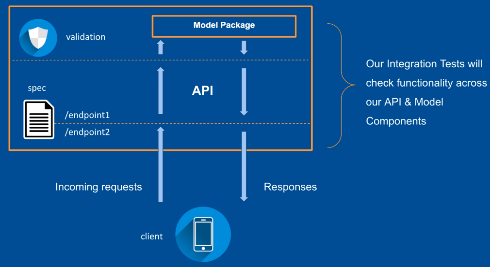

- unit test에서는 각각의 unit들을 독립적으로 test했다면 integration test는 (단어의 뜻 그대로) unit들이 연결된 상태를 test하는 것



## docker를 이용하여 api 띄워보기
- 먼저 `ml_api` 폴더의 구조를 파악해보자
    - `api` 폴더에 flask를 이용한 api가 구현되어 있다.
    - `docker` 폴더에 해당 api를 띄워볼 수 있도록 파일들이 있다.
        - `docker-compose -f docker-compose.yml up` 명령어를 통해서 container를 띄울 수 있다.
    - `Makefile`을 통해서 `run.py`를 실행하도록 한다.
    - `tests` 폴더에는 test 관련 파일들이 있다.

```
.
├── api
│   ├── app.py
│   ├── config.py
│   ├── controller.py
│   ├── __init__.py
│   └── spec
│       ├── api.yaml
│       └── __init__.py
├── docker
│   ├── docker-compose.yml
│   └── Dockerfile
├── __init__.py
├── Makefile
├── mypy.ini
├── requirements
│   ├── requirements.txt
│   └── test_requirements.txt
├── run.py
├── tests
│   ├── conftest.py
│   ├── __init__.py
│   └── test_api.py
└── tox.ini
```

## integration test 해보기
- `ml_api`폴더에서 `tox` 명령어를 실행하면 된다.
- 그런데 [`tox.ini`](./ml_api/tox.ini)을 보면 integration test 부분의 commands에 `-m integration` 옵션이 있다. 이는 해당하는 test함수만 실행하겠다는 의미이다. (`pytest -m {마커명}`)
    - 그럼 해당하는 test함수는 무엇인가?
    - [`test_api.py`](./ml_api/tests/test_api.py)에 `@pytest.mark.integration`으로 감싼 함수를 의미한다.
    - [`tox.ini`](./ml_api/tox.ini)에 `pytest`와 관련한 옵션에 `markers`에 `integration`에 대한 설명도 적었다.

### 결과
```
(study) minsoo@minsoo:~/Workspace/ML-testing-monitoring/ml_api$ tox
integration_tests: recreate env because env type changed from {'name': 'typechecks', 'type': 'VirtualEnvRunner'} to {'name': 'integration_tests', 'type': 'VirtualEnvRunner'}
integration_tests: remove tox env folder /home/minsoo/Workspace/ML-testing-monitoring/ml_api/.tox/integration_tests
integration_tests: install_deps> pip install -r requirements/test_requirements.txt
integration_tests: commands[0]> pytest -s -vv -m integration tests/
======================================================= test session starts ========================================================
platform linux -- Python 3.8.13, pytest-5.4.3, py-1.11.0, pluggy-0.13.1 -- /home/minsoo/Workspace/ML-testing-monitoring/ml_api/.tox/integration_tests/bin/python
cachedir: .tox/integration_tests/.pytest_cache
rootdir: /home/minsoo/Workspace/ML-testing-monitoring/ml_api, inifile: tox.ini
collected 6 items / 1 deselected / 5 selected                                                                                                                                          

tests/test_api.py::test_health_endpoint PASSED
tests/test_api.py::test_prediction_validation[BldgType-1-33-expected_error0] PASSED
tests/test_api.py::test_prediction_validation[GarageArea-abc-45-expected_error1] PASSED
tests/test_api.py::test_prediction_validation[CentralAir-nan-34-expected_error2] PASSED
tests/test_api.py::test_prediction_validation[LotArea--2-expected_error3] PASSED

======================================================== 5 passed, 1 deselected in 3.07s =========================================================
integration_tests: OK ✔ in 24.14 seconds
typechecks: recreate env because env type changed from {'name': 'integration_tests', 'type': 'VirtualEnvRunner'} to {'name': 'typechecks', 'type': 'VirtualEnvRunner'}
typechecks: remove tox env folder /home/minsoo/Workspace/ML-testing-monitoring/ml_api/.tox/integration_tests
typechecks: install_deps> pip install -r requirements/test_requirements.txt
typechecks: commands[0]> mypy api
Success: no issues found in 5 source files
typechecks: OK ✔ in 21.53 seconds
stylechecks: recreate env because env type changed from {'name': 'typechecks', 'type': 'VirtualEnvRunner'} to {'name': 'stylechecks', 'type': 'VirtualEnvRunner'}
stylechecks: remove tox env folder /home/minsoo/Workspace/ML-testing-monitoring/ml_api/.tox/integration_tests
stylechecks: install_deps> pip install -r requirements/test_requirements.txt
stylechecks: commands[0]> flake8 api tests
tests/test_api.py:7:1: E302 expected 2 blank lines, found 1
tests/test_api.py:14:1: E302 expected 2 blank lines, found 1
tests/test_api.py:31:1: E302 expected 2 blank lines, found 1
tests/test_api.py:56:1: E304 blank lines found after function decorator
tests/test_api.py:73:34: W292 no newline at end of file
tests/conftest.py:6:1: E302 expected 2 blank lines, found 1
tests/conftest.py:12:1: E302 expected 2 blank lines, found 1
tests/conftest.py:15:21: W291 trailing whitespace
tests/conftest.py:15:23: W292 no newline at end of file
stylechecks: exit 1 (0.16 seconds) /home/minsoo/Workspace/ML-testing-monitoring/ml_api> flake8 api tests pid=23549
  integration_tests: OK (24.14=setup[20.63]+cmd[3.51] seconds)
  typechecks: OK (21.53=setup[20.53]+cmd[1.00] seconds)
  stylechecks: FAIL code 1 (20.69=setup[20.53]+cmd[0.16] seconds)
  evaluation failed :( (66.40 seconds)
```